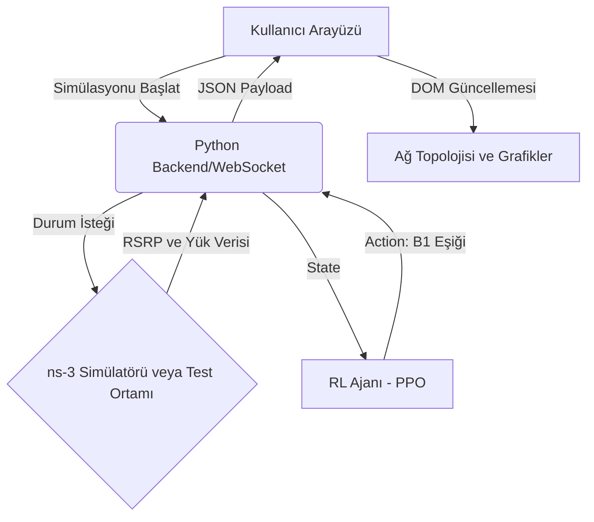

# Ürün Gereksinim Belgesi (PRD)
## 1. Ürün Özeti
5G NSA B1 Threshold Optimizer, ns-3 simülatörü ve Derin Pekiştirmeli Öğrenme (RL) algoritmasının entegrasyonunu görselleştiren, kullanıcıların ağ simülasyonunu ve RL ajanının eşik optimizasyonu (B1 Threshold) kararlarını gerçek zamanlı izleyebileceği modern ve fütüristik bir web tabanlı gösterge paneli (dashboard) uygulamasıdır.

## 2. Temel Özellikler
### Roller
- **Ağ Araştırmacısı / Mühendis:** 5G ağındaki kullanıcı hareketliliğini, sinyal kalitesini (RSRP) ve RL ajanının optimizasyon adımlarını izler.

### Modüller
- **Ağ Topolojisi Görselleştirme:** LTE eNB, 5G gNB ve hareketli UE'leri (kullanıcı cihazları) gösteren 2D/3D ağ haritası.
- **Gerçek Zamanlı Metrikler:** LTE RSRP, NR RSRP, LTE/NR Hücre Yükleri ve Toplam Throughput verilerinin canlı grafikleri.
- **RL Ajanı İzleyici:** Seçilen B1 eşiği kararları, bölüm (episode) ilerlemesi ve ödül (reward) fonksiyonu durumu.

### Sayfa Detayları
- **Ana Gösterge Paneli (Dashboard):** 
  - Üst kısımda özet metrik kartları (Anlık Throughput, Bağlı UE Sayısı, Aktif Eşik).
  - Sol altta dinamik ağ topolojisi (Kullanıcıların baz istasyonlarına olan mesafesi).
  - Sağ altta RSRP sinyal güçleri ve RL kararlarını gösteren zaman serisi grafikleri.
  - "Simülasyonu Başlat/Durdur" kontrolleri.

## 3. Temel Süreç

## 4. Kullanıcı Arayüzü Tasarımı
- **Tasarım Stili:** "Cyberpunk / Retro-Futuristic" - Karanlık tema, neon mavi ve mor vurgular, terminal/konsol hissi veren tipografi, parlayan (glow) efektler.
- **Renk Paleti:** Arka plan `#0a0a12`, kartlar `#141423`, vurgular (Neon Mavi `#00f0ff`, Neon Mor `#b026ff`, Başarı Yeşili `#00ff66`, Hata Kırmızı `#ff003c`).
- **Tipografi:** Başlıklar için monospace veya geometrik sans-serif (örn: `JetBrains Mono` veya `Space Mono`), okunabilirlik için `Inter`.
- **Duyarlılık (Responsiveness):** Desktop-first tasarım yaklaşımı. Tablet ve mobil ekranlarda grafikler ve topoloji haritası alt alta dizilecek şekilde grid/flex yapısı kullanılacaktır.
- **Animasyonlar:** Veri güncellemelerinde hafif yanıp sönme (pulse) efektleri, grafik çizgilerinde pürüzsüz geçişler, UE hareketlerinde CSS transition'lar.
