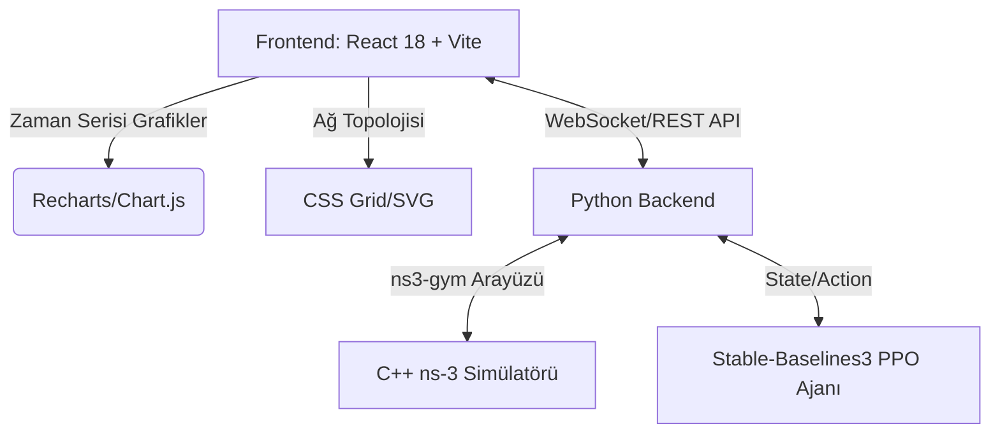

# Teknik Mimari Belgesi
## 1. Mimari Tasarım


## 2. Teknoloji Özeti
- **Frontend Framework:** `react@18`, `react-dom@18`, `vite@5`
- **Stil / Arayüz:** `tailwindcss@3`, `lucide-react` (İkonlar)
- **Veri Görselleştirme:** `recharts` (Basit ve performanslı zaman serisi grafikleri için)
- **Durum Yönetimi:** React Context API veya `zustand` (İsteğe bağlı, karmaşıklığa göre).
- **Backend Entegrasyonu:** İlk aşamada sanal (mock) veri üreten bir hook ile arayüz tasarlanacak. Gelecekte Python WebSocket veya Flask/FastAPI sunucusuna bağlanacak yapı hazırlanacak.

## 3. Rota (Route) Tanımları
Uygulama Tek Sayfa Uygulaması (SPA) olacaktır.
- `/`: Ana Gösterge Paneli (Dashboard). Tüm ağ metrikleri ve RL kararlarını içerir.

## 4. API Tanımları
*(Not: Frontend geliştirilirken aşağıdaki API yapısını taklit eden (mock) bir yapı kullanılacaktır.)*

### `GET /api/simulation/state`
- **Açıklama:** Simülasyonun anlık durumunu, UE metriklerini ve RL ajanının son kararını getirir.
- **Yanıt:**
  ```json
  {
    "step": 42,
    "lte_rsrp": -75.5,
    "nr_rsrp": -120.0,
    "lte_load": 0.8,
    "nr_load": 0.2,
    "ue_count": 5,
    "b1_threshold": -118,
    "reward": 5.0,
    "is_5g_active": false
  }
  ```

### `POST /api/simulation/control`
- **Açıklama:** Simülasyonu başlatır, durdurur veya sıfırlar.
- **Gövde:** `{"action": "start" | "stop" | "reset"}`

## 5. Sunucu Mimarisi
Gelecek entegrasyonda;
- Python tabanlı bir WebSocket sunucusu, `dummy_test.py` veya `train_ppo.py` kodlarına gömülecektir.
- ns-3 `OpenGymInterface` üzerinden saniyede birkaç kez veri alıp Frontend'e yayınlayacaktır.

## 6. Veri Modeli
Frontend tarafında tutulacak ana `state` objesi:
```typescript
interface SimulationState {
  isRunning: boolean;
  currentStep: number;
  metrics: {
    lteRsrp: number;
    nrRsrp: number;
    lteLoad: number;
    nrLoad: number;
    reward: number;
    b1Threshold: number;
  }[];
  networkStatus: {
    is5GActive: boolean;
    connectedUEs: number;
  };
}
```
